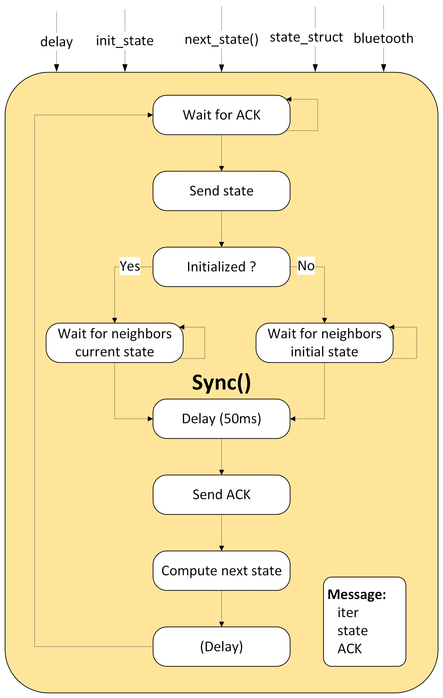
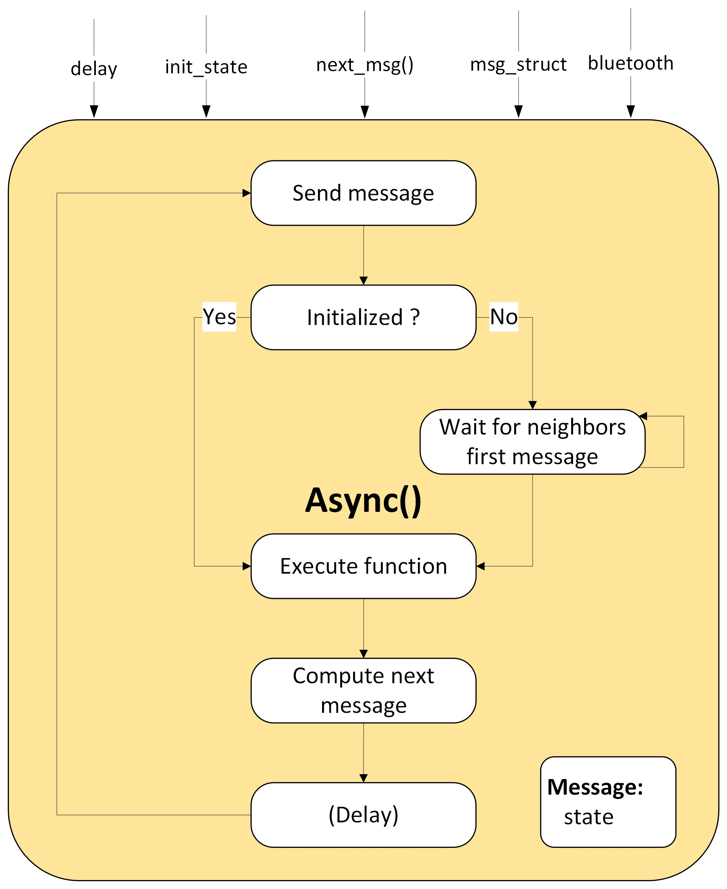
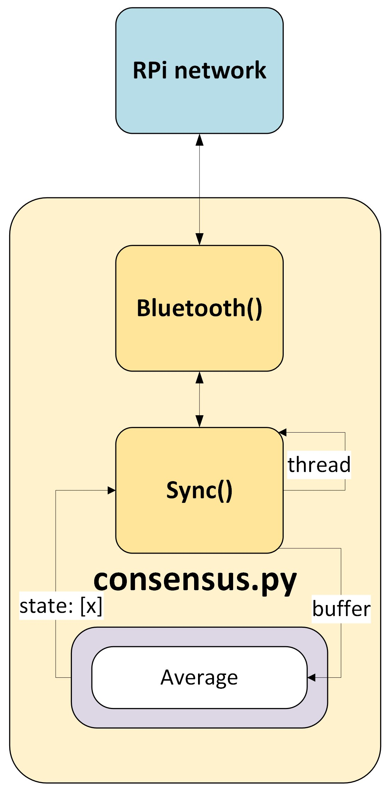
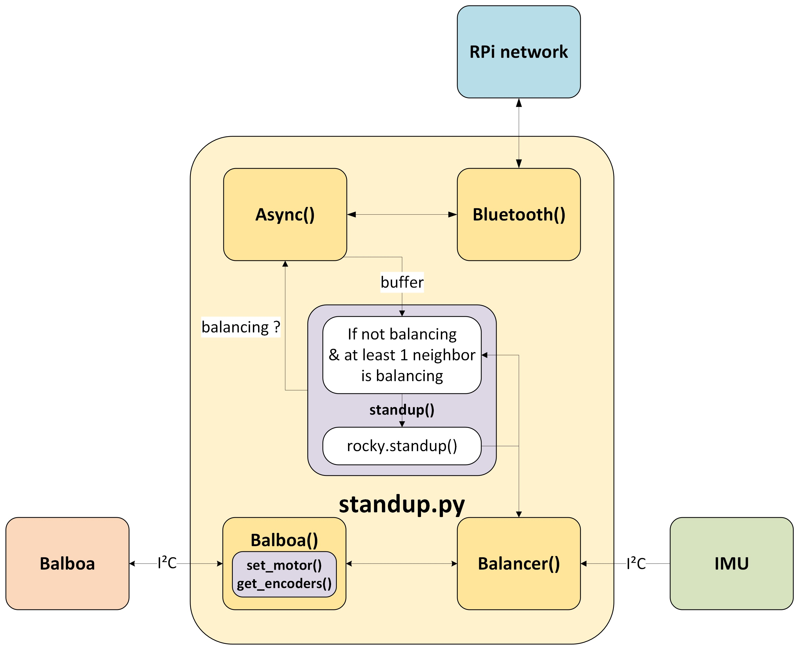

# Robotic swarm platform based on the Balboa self-balancing robot

This repository contains a communication platform within a Balboa swarm. 
A RPi is shielded on each Balboa.
There are two communication protocols used in it:
* I²C communication between RPi and Balboa
* Bluetooth communication within a RPi graph

The agents are equipped with Decawave DWM1001 UWB modules allowing them to measure their position and distances with anchors.

<p align="center">
  
</p>

## Table of Contents

- [System, communication & peripherals](#system-communication--peripherals)
  - [RPi - Balboa Communication: I²C](#rpi---balboa-communication-i²c)
    - [balboa.py](#balboapy)
    - [lsm6.py](#lsm6py)
    - [balance.py](#balancepy)
  - [RPi Network communication: Bluetooth](#rpi-network-communication-bluetooth)
    - [bluetooth.py](#bluetoothpy)
    - [synchronous.py](#synchronouspy)
    - [asynchronous.py](#asynchronouspy)
  - [Decawave DWM1001 - UWB position/distance sensing](#decawave-dwm1001---uwb-positiondistance-sensing)
    - [dwm1001.py](#dwm1001py)
  - [Balboa (Arduino)](#balboa-arduino)
    - [BalboaRPiSlave.ino](#balboarpislaveino)
- [Setup & configuration](#setup--configuration)
  - [RPi's](#rpis)
    - [Bluetooth](#bluetooth)
    - [I²C](#i²c)
    - [DWM](#dwm)
- [Examples](#examples)
  - [Consensus](#consensus)
  - [Synchro](#synchro)
  - [Target localization](#localize)
  - [StandUp](#standup)
  - [Flood](#flood)
  - [Multi-Hop Unicast](#unicast)
- [Scripts](#scripts)
  - [deploy.sh](#deploysh)
  - [run.sh](#runsh)
  - [fetch_csv.sh](#fetchsh)
  - [command.sh](#commandsh)

## System, communication & peripherals

<p align="center">
  
</p>

### RPi - Balboa Communication: I²C
The RPi is connected to the 3.3V side of the bus, all other devices are connected to 5V side
The master is the RPi, it has 4 slaves:
* Balboa 
* IMU 
* OLED screen 
* Magnetometer (not used)

The Balboa manage encoders and push button reading, leds setting and Decawave DWM1001 readings.

The RPi manages the control loop with IMU readings by requesting information from Balboa via I²C.

#### balboa.py
Class that allows RPi to request/write information from/to Balboa using I²C communication such as:
* Encoder values (read)
* Push button (read)
* Battery voltage level (read)
* Position and distance measurement (read)
* Buzzer (write)
* Leds (write)
* Motor speed (write)

#### lsm6.py
Class that allows RPi to request information from IMU using I²C communication such as:
* Acceleration[3]
* Gyroscope[3]

#### balance.py
Run control algorithm in a separate thread.

### RPi Network communication: Bluetooth
#### bluetooth.py
Class that allows RPi's to communicate between them providing:
* **RPi's MAC address list**
* **ID** of the current RPi corresponding of its index in the RPi's MAC address list.
* **Adjacency matrix**: Symmetric square matrix containing edges in the RPi's graph.

<p align="center">
  
</p>

Two steps are performed, after having successfully setup devices beforehand as explained in the next section.

**1. Connection**
* Neighbors are set based on adjacency matrix
* Connection need to be made in only 1 way: lower MAC address connect to higher MAC address
* As soon as a connection is made, a thread is listening incoming messages for this connection.

**2. Communication**
* **Bidirectionnal**
* *send_message(self, type, \*args)* send args converted in hexadecimal based on the specified type following the *struct* library.
* *handle_client(self, conn, addr)* is run by a separate thread for each connection. For example if a RPi is connected to 3 other RPi,
there will be 3 (pseudo) threads running this function.
* Several processes can use the same bluetooth instance with its connections by using process id.
* Last message of process i is stored in *bluetooth.buffer[i]* in hexadecimal format. This buffer has length corresponding to *bluetooth.RPI_MACS*.

#### synchronous.py
Class that enable a synchronous communication within the graph.

It includes a buffer that is composed of decoded values from *bluetooth.buffer* (using a specified structure of types).

The iteration timing is controlled using:
* Acknowledgement loop: avoid to skip any iteration by sending message before every neighbors read the previous one.
* Iteration loop: wait for each neighbor current state before computing the next state.

An acknowledgement is then sent after each state reading but a small delay is needed to avoid sending ackowledgement too fast after the message, it would corrupt the communication. If you get timeout error, it is probably due to this delay that need to be increased.

This synchronization process enables it to run iterative algorithm in a distributed way.

<p align="center">
  
</p>

#### asynchronous.py
Class that enable an asynchronous communication within the graph.

It includes a buffer that is composed of decoded values from *bluetooth.buffer* (using a specified structure of types).

Each (delay) seconds, it will send a message and compute the next one based on neighbors messages and its own state.
It can also execute any function each iteration.

<p align="center">
  
</p>

### Decawave DWM1001 - UWB position/distance sensing
This module can be set as a tag or an anchor
* Attached to agents: tags (position to be measured)
* Balises: anchors (known position to perform triangulation)
* Target: anchor (unknown position, tags can measure their distance between them and the target)
This module is equipped with a SPI/UART/embedded API allowing to communicate with the antenna
* We use UART with the Balboa TX/RX

#### dwm1001.py

This class allow the communication with DWM either by using RPi with the DWM connected on TX/RX from the RPi, or by reading the measures over I²C from the Balboa with the DWM connected on the TX/RX from the Balboa.

<p align="center">
  
</p>

It includes a postprocessing function that uses:
* Moving window average for distance and position
* Calibrated model of the sensor (see /utils/dwm_calibration.py)

The communication with the DWM uses its UART API in generic mode and uses command 0x0C00 (see DWM API guide)

### Balboa (Arduino)
#### BalboaRPiSlave.ino
It includes the *Decawave DWM1001* reading. 
It sends data requested by RPi via I²C and write received data from the RPi.

## Setup & configuration
### RPi's
I use an ssh connection with each of my RPi's by connecting them to hotspot because RPi's cannot connect to eduroam.
Currently, the setup is complete on the RPis. You can connect to them by setting a hotspot with following credentials:
* SSID: Romain
* password: yiwi9000
If you need to do the setup again, follow the instructions hereafter.

#### Bluetooth
Before everything, you should:
* Activate VNC within 
```bash

sudo raspi-config
```

Before the first connection, devices that need to connect are needed to be paired first. 
You should use VNC (or an HDMI monitor) on each devices in order to accept the pair request with its corresponding PIN.

In parrallel, on both RPi's, run:
```bash

bluetoothctl
```
On the first RPi, run
```bash

discoverable on
pairable on
```
On the others RPis, run
```bash

scan on
```
Once the RPi appears in the list:
```bash

pair <MAC_RPi_1>
```

Accept the pair request on the screen using VNC or a monitor. 
Then trust the deivces on both sides:
```bash

trust <MAC_RPi_1>
```

Devices are now paired and will be able to connect using python in the future.

Some RPi Zero 2 are loaded with a bugged bluetooth firmware, they are unable to connect more than a few seconds and commands using hciconfig or btmgmt provides a timeout error.
To handle this, I found that you can force the detection of the proper RPI zero 2 using:
```bash

sudo cp /lib/firmware/brcm/BCM43430A1.hcd /lib/firmware/brcm/BCM43430A1.raspberrypi,model-zero-2-w.hcd
```

#### I²C
RPi is shielded on Balboa using pin headers. Balboa includes a level shifter connected between SDA/SCL from Arduino and RPi, creating two sides on the bus.

I²C can be activated within :
```bash

sudo raspi-config
```

I²C speed can be set for the RPi in the following file:
```bash

sudo nano /boot/firmware/config.txt
```
Then, modify this line like this to set a baudrate of 100kHz.
```bash

dtparam=i2c_arm=on,i2c_arm_baudrate=100000
```
You may need to set 200 kHz for RPi 4b and some other RPi versions to get actually approximately 100 kHz due to CPU scaling.

A delay is set on the Balboa (slave) side in BalboaRPISlave.ino, 10 is supposed to work for 100 kHz, 
but you could put it to 15 or 20 if you get I²C I/O errors.
```C
PololuRPiSlave<struct Data,20> slave;
```

### DWM
You should activate serial communication inside:
```bash

sudo raspi-config
```
After that, connect the DWM on native UART port of the RPi and it should appears as /dev/serial0.
You can open a shell running:
```bash

sudo minicom -D /dev/serial0
```
Type 'enter' twice to switch the DWM UART mode from generic to shell.
You should get 'dwm>' allowing the laptotp to send commands (type help to see).

On some RPis, data could be sent automatically. It can be solved by removing the line containing serial0 in /boot/firmware/cmdline.txt

The setup of each node should be done using the mobile app, see the DWM documentation.

## Examples
For these examples, bluetooth and I²C communication need to be setup before the first use as described in the previous section. The setup is already operational on the RPis, you can access them by setting a hotspot with the following credentials:
* SSID: Romain
* password: yiwi9000

Each of these example use one Bluetooth class instance with one or several class instances of Async or Sync.
To interact with the Balboa they can include an instance of the class Balboa, to make them balancing the Balboa instance should be given to a Balancing class instance.

Before each of these example, you should specify your setup by setting the following variables in /RPi/utils.py:
* *RPIS_MACS*
* *ADJACENCY* 

### Consensus
This is an example of a **synchronous** communication
A consensus algorithm will make the RPi graph to converge toward the same state without direct communication.
This example contains a very basic algorithm that performs the **average between the RPi state and its neighbors states** that have been sent over Bluetooth.

<p align="center">
  
</p>

It uses:
* Bluetooth
* Sync
* May include Balboa to use leds

```
Usage: python consensus.py <ID> <init_state> <i2c>
```
ID is the index of the current RPi in bluetooth.RPIS_MACS, init_state is the initial state of the current RPi and i2c is set to 0 when the RPi is not shielded on the Balboa, 1 otherwise to use leds to observe convergence.

The format of the state used in this example 'f' (float) corresponding to the value that is averaged. 

### Synchro
This is an example of a **multi-process** synchronous communication
This algorithm uses the same basic algorithm of the previous consensus example, but on 2 values: phase and frequency. The blinking of the leds of the Balboa reflects both states.

<p align="center">
  
</p>

It uses:
* Bluetooth
* 2x Sync (phase and frequency)
* Balboa

```
Usage: python synchro.py <ID> <init_frequency>
```
ID is the index of the current RPi in bluetooth.RPIS_MACS, init_frequency is the initial state of the frequency consensus of the current RPi

### Target localization
This is an example of synchronous communication using Decawaves providing real measures.
The purpose is to localize a target using agents at known position with distance measurements up to the target.
The measurements are done using Decawave DWM1001 UWB modules.

<p align="center">
  
</p>

It uses:
* Balboa
* DWM
* Sync
* Bluetooth

The next state is computed based on position of agent and distance up to the target, using the gradient descent algorithm.
All agent will converge toward the same target position, despite the fact that the graph is not fully connected.

```
Usage: python localize.py <ID>
```
ID is the index of the current RPi in bluetooth.RPIS_MACS


### StandUp
This is an example of **asynchronous** communication
This example will make the Balboa stand up like dominos. If a Balboa is down and one of its neighbors is up, it will stand up.

<p align="center">
  
</p>

It uses:
* Bluetooth
* Async 
* Balboa
* Balancing
```
Usage: python standup.py <ID>
```
ID is the index of the current RPi in bluetooth.RPIS_MACS

The delay of asynchronous communication should be high enough to be safe with the robots.


## Scripts

I created 4 bash scripts that aim to facilitate and accelerate the testing process and interaction with the swarm. 
Indeed, uploading each file manually using Filezilla with different parameters and executing each of them separately on each RPi could take time. Same for doing some plots.

Before running these scripts, make sure the execution permission is set or run:
```bash

sudo chmod +x ./deploy.sh
```

### deploy.sh
This script can be used instead of **Filezilla** to transfer files faster and easier.

This script allows the user to transfer the same files to several RPi on the same LAN network using scp.
It is especially useful when working with a lot of RPi

```
Usage: ./deploy.sh <IP1> <IP2> ... <IPn>
```

Inside deploy.sh, you should change the following lines corresponding to your own setup:
* **LOCAL_DIR** must be set as the PC side directory containing all files to transfer.
* **REMOTE_DIR** must be as the RPi side directory that will contain transferred files
* **USER** is the RPi user used to connect via ssh
* **SSH_KEY** can contain the path to an ssh key to avoid being asked to type ssh password

### run.sh
This script can be used to run the same program on several RPi's via ssh.
It allows the user to specify the python file to run as well as args.

```
Usage: ./run.sh <python_program> <IP1>:<param1>,<param2>,... <IP2>:<param1>,<param2>,...
```

The first argument given to the python file MUST be its ID among bluetooth.RPIS_MACS.
User do not need to type it for each RPi, it is automatic: the first IP will run python program with ID 0.

Inside run.sh, you should change the following lines corresponding to your own setup:
* **USER** is the RPi user used to connect via ssh
* **SSH_KEY** can contain the path to an ssh key to avoid being asked to type ssh password

For example, consensus example can be run for 3 RPi's with this single command : 
```bash

./run.sh /home/trebelge/Documents/synchro/Bluetooth/main_consensus.py 192.168.1.37:10.0,0 192.168.1.35:3.0,0 192.168.1.17:5.0,0
```

### fetch_csv.sh
This script can be used instead of **Filezilla** to get files faster and easier from RPi.

This script allows the user to transfer a file available on each RPi, on a computer on the same LAN network using scp.
It is especially useful when working with a lot of RPi.

```
Usage: ./fetch_csv.sh file_name <IP1> <IP2> ... <IPn>
```

Inside fetch_csv.sh, you should change the following lines corresponding to your own setup:
* **DEST_DIR** must be set as the PC side directory where files will be transfered.
* **REMOTE_CSV_PATH** must be as the RPi side directory that will contain file_name.csv
* **USER** is the RPi user used to connect via ssh
* **SSH_KEY** can contain the path to an ssh key to avoid being asked to type ssh password


### command.sh
This script can be used to send the same command to all RPis
It is especially useful when working with a lot of RPi

```
Usage: ./command.sh 'command' <IP1> <IP2> ... <IPn>
```

Inside command.sh, you should change the following lines corresponding to your own setup:
* **USER** is the RPi user used to connect via ssh
* **SSH_KEY** can contain the path to an ssh key to avoid being asked to type ssh password

For example, in order to shut down every RPi, run:
```bash

./command.sh "sudo shutdown -h now" 192.168.1.37 192.168.1.35 192.168.1.17
```